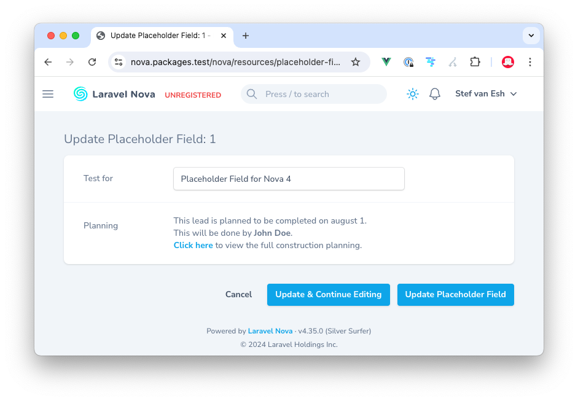

# Nova Placeholder field

[](https://packagist.org/packages/marshmallow/nova-placeholder)
[](https://packagist.org/packages/marshmallow/nova-placeholder)
[](https://github.com/marshmallow-packages/nova-placeholder-field/issues)
[](https://github.com/marshmallow-packages/nova-placeholder-field/blob/main/LICENSE.md)

A placeholder field to just show some content on forms without any logic.

This package adds a Placeholder field which you can use in Laravel Nova. It only outputs some HTML in the forms of your resource. This is not a field to store any data — it just displays some stuff.



## Installation

Install the package via Composer:

```bash
composer require marshmallow/nova-placeholder
```

The service provider is auto-discovered, so there is nothing else to register.

## Usage

Add the field to a Nova resource and pass the HTML you want to output to the `content()` method. That's it!

```php
use Marshmallow\Placeholder\Placeholder;

Placeholder::make(__('Planning'))
    ->content('This lead is planned to be completed on august 1. This will be done by <strong>John Doe</strong>.<br/><a href="">Click here</a> to view the full construction planning.'),
```

You can also render a Blade view instead of an inline string with the `view()` method. The first argument is the view name and the second is the data passed to it:

```php
use Marshmallow\Placeholder\Placeholder;

Placeholder::make(__('Planning'))
    ->view('components.planning', [
        'lead' => $lead,
    ]),
```

The field never writes to the underlying model, so it is safe to use on create and update forms purely for display.

## Changelog

Please see [CHANGELOG](CHANGELOG.md) for more information on what has changed recently.

## Security

If you discover any security related issues, please email stef@marshmallow.dev instead of using the issue tracker.

## Credits

-   [Stef van Esch](https://github.com/stefvanesch)
-   [All Contributors](../../contributors)

## License

The MIT License (MIT). Please see the [License File](LICENSE.md) for more information.
